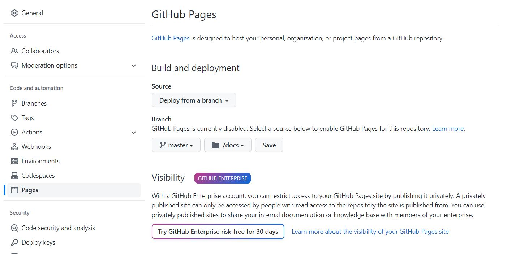
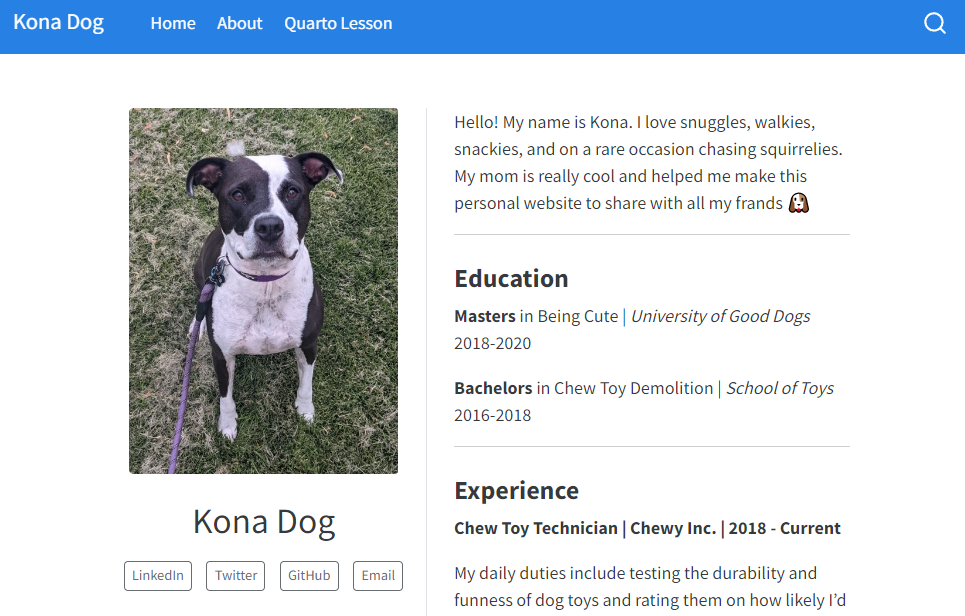

# Quarto Website Demo

## What is Quarto?

Quarto is a publishing system that allows you to weave together content
and executable code into a finished document using R, Python, Julia, and
ObservableJS, with plans to add more languages. You can thing of Quarto
as an extension of R Markdown, but with more features and additional
languages. R Markdown is still under active development and is not going
anywhere, however many in the data science realm are switching to Quarto
instead.

You may notice if you open this lesson in in R Studio, while it is a
.qmd document it looks and functions nearly identical to a .Rmd
document! Therefore your knowledge of R Markdown is easily transferable
to Quarto.

<figure>


<figcaption aria-hidden="true">

Artwork from "Hello, Quarto" keynote by Julia Lowndes and Mine
Çetinkaya-Rundel, presented at RStudio Conference 2022. Illustrated by
Allison Horst.

</figcaption>

</figure>

<br>

::: {.alert .alert-info}
Quarto operates as a stand-alone software, however with RStudio
v2022.07.1 + Quarto is included, therefore there is no need to
separately install Quarto if you have the latest version of RStudio.
:::

## Why build a website in Quarto?

There are plenty of R-based options to create a personal website such as
`blogdown` and `distill`, however I've found creating a website in
Quarto is more simple/straightforward in terms of file structure and
publishing. This is not to say you shouldn't consider the other options!
I made [my personal website](https://caitlinmothes.com) in blogdown for
example (code can be found
[here](https://github.com/ccmothes/personalWebsite)), but this was
before Quarto existed and I have since found websites in Quarto to be
slightly easier to teach. So that is what we will work through today!

## Getting Started

The structure of Quarto websites is actually nearly identical to that of
R Projects (and they actually create an .Rproj file when you create the
website). Let's get started:

Go to File -\> New Project -\> New Directory -\> Quarto Website. Name is
important here, as it will eventually become the slug (i.e., URL) for
your site when we host it with GitHub Pages. Since this is a demo, I
will call it 'website-demo'.

::: {.alert .alert-info}
If you already know you want this to be your personal website, **name it
your GitHub username**. GitHub Pages creates websites with the
**github.io** suffix, and allow you one URL with your username (i.e.,
**username.github.io**), which is likely the preferred URL you would
want to give your personal site.
:::

Leave all the other defaults in the Create Website menu. Once you create
the site, you will now notice you are working in an R Project with the
site name you just gave it, and see four files in your project directory
(*We will get back to these later*).

## Connect to GitHub

We now have a Quarto website project, but it is not yet linked to GitHub
(which we will need to host the site). Let's explore a new package here
called `usethis` which assists in project workflow management. With this
package we can actually create a GitHub repo from an R project (instead
of the usual method of creating a repo first and then creating a
project).

If you haven't yet, install the package:

``` r
install.packages("usethis")
```

Then, in the console run the follow line of code. It will prompt you if
you want to commit all your files, say Yup. It will then ask if you want
to Restart R, say "Absolutely", and click 'Yes' to restart even if
prompted that the session is busy.

``` r
usethis::use_git()
```

You will now notice the 'Git' tab in RStudio, meaning it is connected to
Git now, however we haven't synced this to your personal (remote) GitHub
repo. To do so, next run this line of code in the console:

``` r
usethis::use_github()
```

## Configure and Publish with GitHub Pages

First there are some mandatory configurations to set in order to publish
with GitHub Pages. Carry out the following steps *in order:*

1.  Create a file named `.nojekyll` . Spelling is important! Also note
    that this creates an empty file that will be hidden in your file
    directory but it will show up as an untracked file in Git. Open your
    **terminal** and run the following:

    ``` r
    touch .nojekyll
    ```

2.  In the YAML header in the `_quarto.yml` file set the `output-dir` to
    "docs" like this in the first 'project' section at the top under
    `type: website` :

    ``` r
    project:
      type: website
      output-dir: docs
    ```

3.  Now *Build* your site by clicking on the **Build** tab (top right
    quadrant in RStudio next to the 'Git' tab), and click **Render
    Website.** You should see a minimal website appear in either the
    **Viewer** tab or a separate window (depending on your RStudio
    settings). You can click the send to browser Icon to view it in the
    web browser.

Great, you now have a functional website! However it is not hosted
publicly yet. In the next steps we will go to GitHub to set up our
GitHub Pages site.

**BUT FIRST! You need to push all of your files to GitHub.**

Stage all files by using `git add .`, then commit and push everything.

Now go to your GitHub account and navigate to the repo you made for this
website. Click **Settings** and then **Pages** on the left hand side
navigation bar.

Under Branch click the drop down menu and choose **main/master branch**,
then choose the **docs/ folder** (like the image below) and **click
Save.**



Wait a minute or so and then refresh the page. You will then see the new
URL created for your site. You can now navigate to and share this URL to
access your site! Now every time you edit your website, 'Render Website'
in RStudio, and push **all** changed files (always use `git add .` with
Quarto websites), your site will automatically update as well after you
push (it may just take a few minutes to see the changes).

Also, below in settings you will see an option to add a custom domain.
If you purchase your own domain name (for example, I purchased
caitlinmothes.com) you can then link that domain name here to use to
navigate to your site.

## Customize your site

Getting the website template up and hosted may likely be the hardest
part of creating a Quarto website. Now we can start customizing!

**NOTE: Before you get started adding any new content, there are two
very important things:**

1.  Don't touch the docs/ folder! Don't ask why, just don't do it.
2.  You *must* Render Website (in the Build tab) before pushing your
    website changes (this updates the docs/ folder which GitHub pages
    builds the website from)

### Update the homepage with `index.qmd`

All edits to your homepage go in the `index.qmd` file. Since we are
making personal websites here, a big edit we can make is changing this
to an "About" page. All edits will go in the YAML header of `index.qmd`.
We will change/add `title:` (your name), `image:` (file path to an
image, *note that this should be in the root directory of the website*),
and numerous arguments under `about:` such as layout style ([see options
here](https://quarto.org/docs/websites/website-about.html#templates)),
image aesthetics and links to social media/contact accounts.

Edit the following code below to match your personal information and
paste it in the YAML header of `index.qmd`.

For this example, I am creating a website for my cute dog Kona.

``` r
title: "Kona Dog"
image: kona.png
about: 
  template: trestles
  image-shape: rounded
  image-width: 15em
  links:
    - text: LinkedIn
      href: https://www.linkedin.com/in/konadog/
    - text: Twitter
      href: https://twitter.com/konadog
    - text: GitHub
      href: https://github.com/konadog
    - text: Email
      href: mailto:konadog@colostate.edu
```

After saving the `index.qmd` file with your changes, click 'Render
Website' to view the changes to the homepage.

*Remember: your site will not be updated until you Render Website and
push all changes to GitHub.* You can edit and 'Render Website' as much
as you want in your R Session to view changes.

Now let's change the content to the right of our photo. In the main body
of `index.qmd`, delete the template text and add whatever information
you want (such as an intro, education, job titles). *Note that using
`---` in the Source Editor of a Quarto document will add line dividers.*
Edit the rest of the text as you would in the Visual Editor.

### Add more pages to your site

The process of adding more pages to your site is:

1.  Create a new .qmd with the content you want and save it in the root
    directory. To do so go to File -\> New File -\> Quarto Document.
    Keep the output as HTML, but edit everything else as you want.

2.  Update the `_quarto.yml` by adding the name of the new .qmd to the
    list of pages

For example I created a .qmd called (quarto-lesson.qmd). If you are new
to Quarto, you can edit this file exactly like you would edit or code in
a .Rmd R Markdown file.

Once I edit and save the file, I would add `quarto-lesson.qmd` in the
`_quarto.yml` file under the `about.qmd` file. You can edit the title of
this page in the navigation bar by adding a `text:` argument, otherwise
it will automatically use the document title. For example my new
`_quarto.yml` file looks like this:

``` r
project:
  type: website
  output-dir: docs

website:
  title: "Kona Dog"
  navbar:
    left:
      - href: index.qmd
        text: Home
      - about.qmd
      - quarto-lesson.qmd

format:
  html:
    theme: cosmo
    css: styles.css
    toc: true

editor: visual
```

### Website Themes

Lastly, you likely want to have more choice in the aesthetics of your
site. You can easily do that by choosing from numerous built-in themes
(view all 25 [here](https://bootswatch.com/)) add adding the theme name
to `theme:` under `html:` in `format` of your `_quarto.yml` file. You'll
notice the default theme is `cosmo`.

## Finalize your site

Once you have edited your site to your liking, remember to 1) Render
Website and then 2) Push all changes to GitHub. Your site will update
after a minute or so, and you can carry out this process whenever you
want to edit or update your site.

### My Website Demo

If you'd like to see the website I created for this demonstration, its
live at: <https://ccmothes.github.io/website-demo/>



## Acknowledgements

Thanks to other blogs and Quarto documentation that helped guide this
lesson plan, particularly [this wonderful
blog](https://ucsb-meds.github.io/creating-quarto-websites/) by Sam
Csik.
