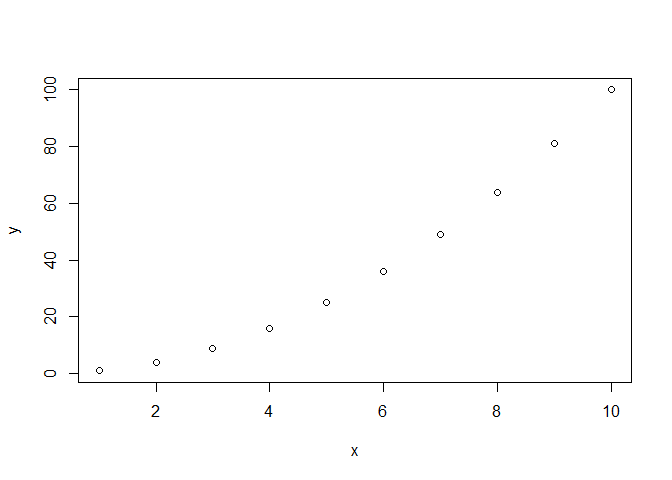

Fancy R Markdown
================
2023-02-28

# R Markdown

This is an R Markdown document. R Markdown is a simple formatting syntax
that allows you to create dynamic documents that combine text, code, and
code output. R Markdown documents can be compiled to a variety of output
formats including HTML, PDF, or Word documents; books; presentation
slides; dashboards; and \[much much more\]
(<https://rmarkdown.rstudio.com/gallery.html>).

The main advantage of using R Markdown over plain R scripts (i.e., `.R`
files) is that it allows you to write both code and text in the same
document, making it easier to document and share your work. R Markdown
also allows you to include formatted text, such as headings, lists, and
tables, and to customize the appearance of your document using templates
and stylesheets. You can also include visualizations and other output
from your R code directly in your document, making it easy to create
dynamic, interactive reports.

# YAML headers

The YAML header is an important part of an R Markdown document, as it
provides key information about the document and controls various aspects
of the rendering process. By customizing the YAML header, you can create
documents that are tailored to your specific needs and preferences.

The YAML header is enclosed in three dashes (—) at the top of the file,
followed by one or more lines of YAML code.

# Knitting

When you click the **Knit** button a document will be generated that
includes both content as well as the output of any embedded R code
chunks within the document.

# R Markdown Syntax

In this R Markdown, I’ve provided some handy syntax to tailor you R
Markdowns to your liking. Many of these tips are also included in
Posit’s [R Markdown Cheat
Sheet](https://posit.co/wp-content/uploads/2022/10/rmarkdown-1.pdf).

With this R markdown document, I suggest switching between **Source**
and **Visual** in R Studio to see what most of this syntax looks like
visually after it is knitted and created.

# Section 1: Headings

## Subheading

### Sub-Subheading

# Section 2: Emphasis

*italic*

**bold**

***bold and italic***

# Section 3: Lists

## Unordered List

- Item 1
- Item 2
- Item 3

## Ordered List

1.  First item
2.  Second item
3.  Third item

# Section 4: Links

[Link text](http://example.com)

# Section 5: Images


# Section 6: Code

You can embed an R code chunk like this:

``` r
# code block comments with #
x <- 1:10
y <- x^2
plot(x, y)
```

## 

## Customizing Code Chunk Output

Note that the `echo = FALSE` parameter was added to the code chunk above
to prevent printing of the R code that generated the plot. Code chunks
are sections of your document that contain executable code, and you can
use code chunk options to control how that code is executed and
displayed.

Here are some common code chunk options in R Markdown:

- `echo`: Controls whether or not the code in the chunk is displayed in
  the output. If `echo=FALSE`, only the output will be displayed.

- `eval`: Controls whether or not the code in the chunk is executed. If
  `eval=FALSE`, the code will not be executed.

- `include`: Controls whether or not the chunk is included in the
  output. If `include=FALSE`, the chunk will be skipped.

- `results`: Controls what is displayed in the output. If
  `results='hide'`, nothing will be displayed. If `results='markup'`,
  the output will be interpreted as Markdown. If `results='asis'`, the
  output will be interpreted as raw text.

- `fig.cap`: Sets the caption for figures generated by the chunk.

- `fig.width` and `fig.height`: Control the width and height of figures
  generated by the chunk.

- `cache`: Controls whether or not the results of the code chunk are
  cached. If `cache=TRUE`, the results will be cached and reused the
  next time the chunk is executed.

## Inline code

You can use back ticks \` \` to format inline (i.e., sandwiched in text)
code. For example 1 + 1 = 2!

# Section 7: Blockquotes

> This is a blockquote.

# Section 8: Horizontal “Page Break”

------------------------------------------------------------------------

# Section 9: Math

## Inline Math

You can use LaTeX syntax[^1] to format inline math, like this:
$y = mx + b$

## Display Math

You can also use LaTeX syntax to format display math, like this:

$$
\int_{-\infty}^{\infty} e^{-x^2} dx = \sqrt{\pi}
$$

# Section 10: Tables

| Column 1        | Column 2        | Column 3        |
|-----------------|-----------------|-----------------|
| Row 1, Column 1 | Row 1, Column 2 | Row 1, Column 3 |
| Row 2, Column 1 | Row 2, Column 2 | Row 2, Column 3 |

# Section 11: Rmarkdown Themes

Add the “theme” option to the YAML header, followed by the name of the
theme you want to use. For example:

``` r
output:
  html_document:
    theme: yeti
```

You can choose from a variety of built-in themes in R Markdown,
including “default”, “cerulean”, “cosmo”, “flatly”, “journal”, “lumen”,
“paper”, “readable”, “sandstone”, “simplex”, “spacelab”, “united”, and
“yeti”.

# Section 12: Alert Messages

<div class="alert-danger">

This is a danger message!!

</div>

<div class="alert alert-warning">

This is a warning message!

</div>

<div class="alert alert-info">

This is an informational message.

</div>

# Section 13: Icons

## Emojis

🥰 💅🍦

You can view all available emojis by viewing the .Rmd with **Visual**,
then **Insert** -\> **Special Characters** -\> **Insert Emoji…**

## Unicode

° µ 𝞫

You can view all available unicode characters by viewing the .Rmd with
**Visual**, then **Insert** -\> **Special Characters** -\> **Insert
Unicode…**

# Section 14: Footnotes

Here is some text with a footnote.[^2]

[^1]: LaTeX is a document preparation system used for typesetting and
    publishing documents, especially those with complex mathematical
    equations and formulas. It uses a markup language that is similar to
    HTML, but is specifically designed for producing high-quality
    documents.

[^2]: Here is the second footnote.
